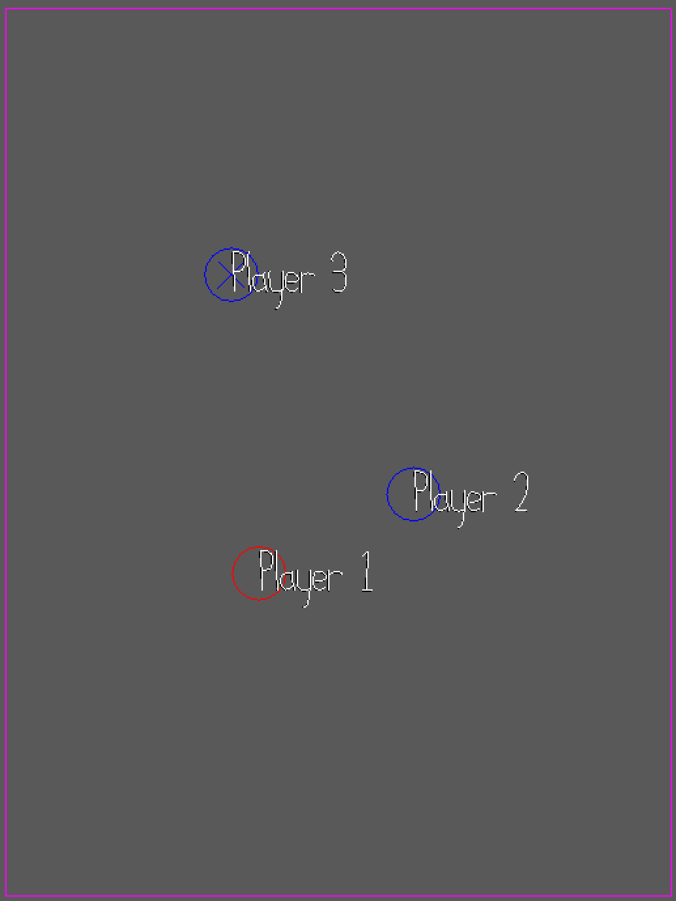

# Stuck in the Mud

Author: Mandy Hu

Design: The game is a video game version of the elementary school game that we played in recess 
called stuck in the mud, where the once a player has been  tagged, they are unable to move
from their spot until released by another player.

Networking: (TODO: How does your game implement client/server multiplayer? What messages are transmitted? Where in the code?)
The game implements client/server multiplayer in the same way as the example game. Playmode.cpp 
keeps track of the buttons pressed by the player, and sends the information to Game.cpp using
controls.send_controls_message(&client.connection). Game.cpp then updates the player's velocity
and position using that information, and checks for collisions, then sending this information
back to the client using Game::send_state_message.

Screen Shot:

How To Play: 
This is best played with at least 3 users.
Players in red are "it", and their goal is to try to freeze all of the blue players.
Once a blue player is frozen, they can only be unfrozen if all another blue player comes
and tags them. The game is over when all of the blue players have been frozen.

All players use wasd to control movements

Sources: All assets were original assets from example game.

This game was built with [NEST](NEST.md).

